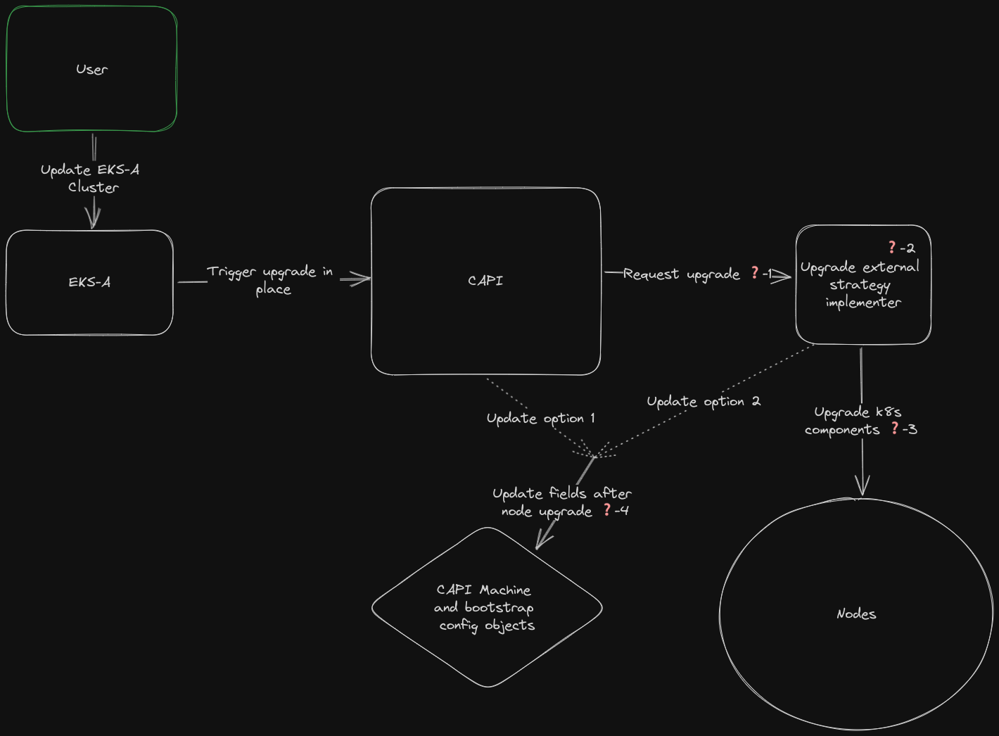
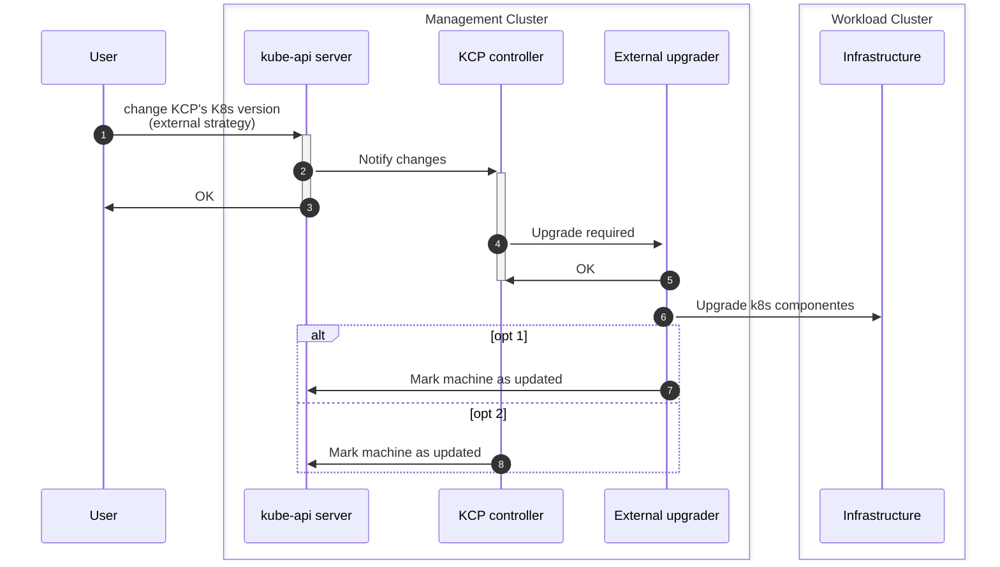
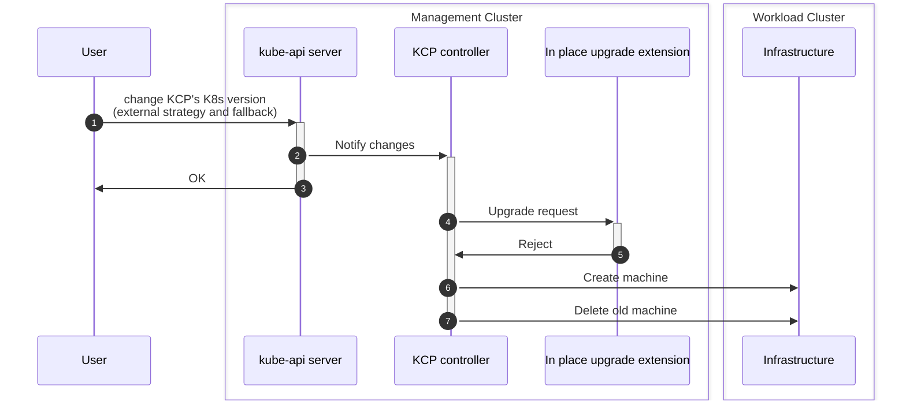
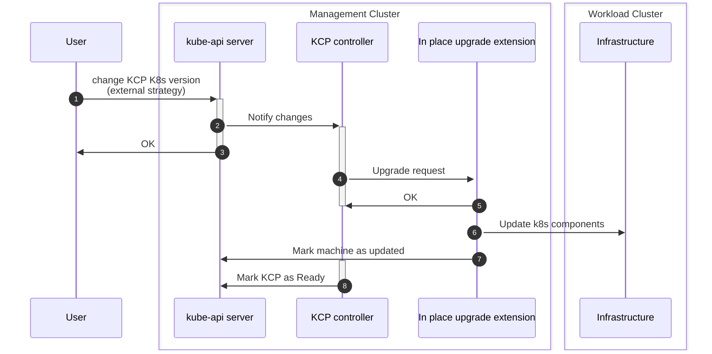
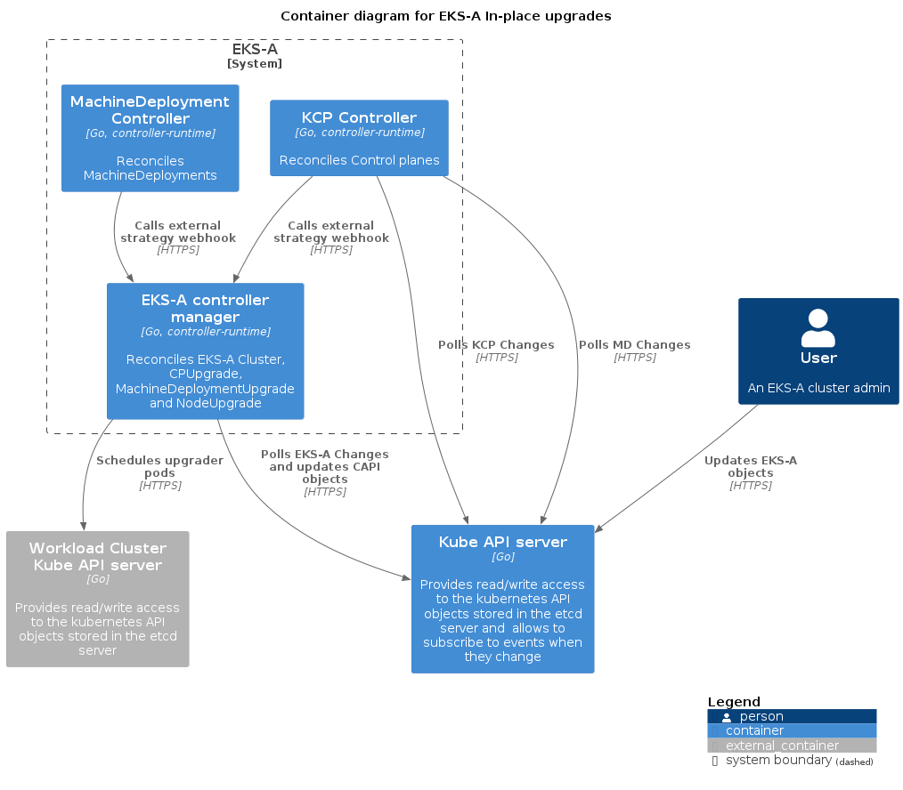
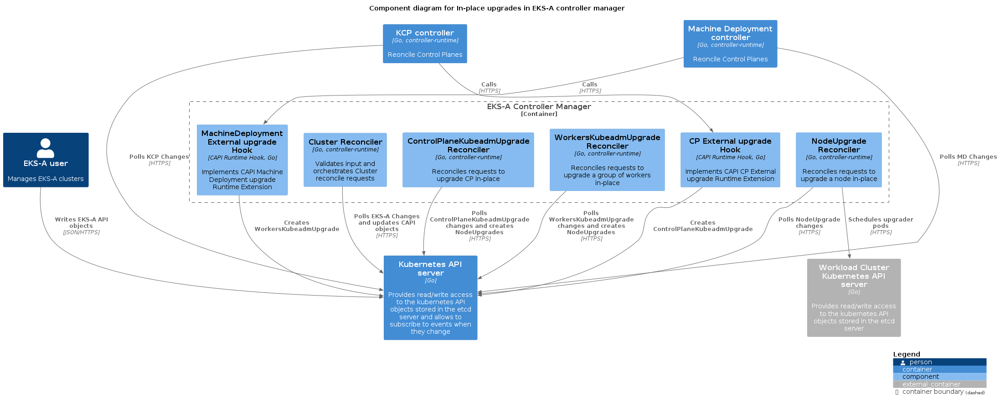

# In-place upgrades
## Introduction
At present, the only supported upgrade strategy in EKS-A is rolling update. However, for certain use cases (such as Single-Node Clusters with no spare capacity, Multi-Node Clusters with VM/OS customizations, etc.), upgrading a cluster via a Rolling Update strategy could either be not feasible or a costly operation (requiring to add new hardware, re-apply customizations...).

In-place upgrades aims to solve this problem by allowing users to perform Kubernetes node upgrades without replacing the underlying machines.

### About this doc
This is a a high level design doc. It doesn't answer all the questions or give a complete implementation spec. Instead, it presents a high level architecture: the communication patterns and dependencies between all components and a concrete implementation for each new component.

The goal is to bring enough clarity to the table that a general solution can be agreed upon, so the work can be split by component. Each of these components might present their own challenges that will need to be addressed, at their own time, by their respective owners (with or without a design doc).

## Goals and Objectives
### User stories
- As a cluster operator, I want to upgrade (EKS-A version and/or K8s version) my baremetal clusters without loosing any OS changes I have made to the machines and  without needing extra unused hardware.
- As a cluster operator, I want to in-place upgrade (EKS-A version and/or K8s version) my baremetal clusters in air-gapped environments.
- As a cluster operator, I want to in-place upgrade (EKS-A version and/or K8s version) my single node baremetal clusters.

### Out of scope
* External etcd

## Overview of the Solution
This section will walk from high level idea to concrete implementation. It'll start with a rough component and interaction overview, then list the remaining problems/questions and finish with the individual solutions for each of these questions.

The first half explains how to add in-place to Cluster API: it proposes a pluggable upgrade strategy architecture that allows existing CAPI controllers to delegate the upgrade process to an external entity, enabling replacing the default "rolling update" strategy. It defines the communication patterns to be followed as well as API and behavioral contracts. This is the part that could potentially become a CAEP (proposal upstream).

The second half defines how EKS-A would leverage and implement such pluggable strategy to offer in-place upgrades.

### CAPI implementation goals
- Avoid "hardcoding" all the new upgrade logic in the existing core/kubeadm controllers.
	- Different users might have different preferences on how to perform these upgrade operations and it seems unreasonable to expect CAPI to meet them all. Requirements around security, access, audit, tooling, OS, infrastructure etc. can variate substantially from environment to environment.
	- Moreover, certain users might already have "provisioning" systems they might want to leverage.
- Maintain a coherent UI/UX between rollout upgrades and in-place upgrades. This means that an in-place upgrade must be triggered in the same way as an rolling upgrade: the user just updates the CAPI objects (KCP, MachineDeployment, etc.). The only difference should be the fields and values configured in those objects.
- Users should be able to keep their cluster running basically indefinitely just with in-place upgrades. This means that theoretically there is no need to ever rollout new nodes: users can keep using in-place upgrades to update their clusters to new k8s versions forever.

### High level view
**TLDR**: CAPI still decides when an upgrade is required but it delegates to an external component the work to perform it. After the upgrade process is completed, `Machine` (and maybe `BootstrapConfig`) objects are updated to reflect the k8s component level changes.

Both KCP and MachineDeployments controllers follow a similar patter around upgrades: they first detect if an upgrade is required and then they read the configured strategy to follow one process or another. We can find a configurable upgrade strategy field in the [KCP](https://doc.crds.dev/github.com/kubernetes-sigs/cluster-api/controlplane.cluster.x-k8s.io/KubeadmControlPlane/v1beta1@v1.5.2#spec-rolloutStrategy-type) and [MachineDeployment](https://doc.crds.dev/github.com/kubernetes-sigs/cluster-api/cluster.x-k8s.io/MachineDeployment/v1beta1@v1.5.2) objects. The strategy is supposed to configure “how” machines are upgraded.

Given CAPI's infrastructure immutability constraints, this is currently scoped to just machine replacement (the only available strategy is “rolling update”). What if in-place upgrades can be just another strategy? That fits the current API and abstractions quite well. Moreover, what if the logic to follow by the strategy was implemented outside of the core CAPI controllers?



This solution decouples the core CAPI controllers from the individual possible strategies that can be followed for an upgrade. CAPI users (us) could choose to implement their own strategy while leveraging the capabilities of the existing controllers. In addition, they could iterate on those strategies without requiring changes in CAPI.

The only thing that would change from the current UX configuring the KCP/MachineDeployment is a `strategy: external`. This solution allows to leverage the existing logic in these two controllers to determine when changes are required, so this doesn't need to be replicated elsewhere. Once the need for changes has been determined, these controllers will hit the registered hooks informing of the selected Machines and the computed difference between current Machine and desired Machine. The external strategy implementers would take over the process and perform the necessary actions.

Note: the external external strategy pattern is not tied to just in-place upgrades: it can be used to change the machine upgrade order, fine control the timing of each machine upgrade, etc. On EKS-A we will just implement an strategy that upgrades machines in place.

The following diagram presents the same idea as above but with a concrete example for the KCP and in a different format, just as additional clarification.



#### Remaining questions
Following the first diagram, all points marked with a ❓:
1. How does CAPI request an upgrade from the external strategy implementer and what information does it need to provide?
2. Where does EKS-A implement the in-place upgrade strategy?
3. How does the EKS-A in-place strategy upgrade the components in the running nodes?
4. Who is responsible for updating the CAPI `Machine` objects so the rest of controllers detect the upgrade has been completed?
	1. Option 1: the CAPI KCP/MachineDeployment controllers. The external strategy will need a way to signal this.
	2. Option 2: the external strategy implementer that accepted the upgrade request.

1 and 4 are decisions that need to be made at the CAPI level, since they conform the "external strategy contract". 2 and 3 are decoupled from CAPI and EKS-A can freely decide how to solve them and/or change them later (as long as they still allow to conform to the given contract).

**Warning**: the idea of using an external strategy and the below proposed solutions for 1 and 4 are subject to change since they still have to be accepted by the CAPI community.

### CAPI external strategy contract
#### Communication pattern
There two obvious options: webhooks or the CRDs + controller model. The tradeoffs are mostly the same as in any other system, so this doc won't enumerate them.

CAPI already already uses both:
- CRD/contract based extension for infra, CP and bootstrap providers. These are "plug-in, swappable low-level components" (quoting the Runtime SDK proposal)
- Webhooks for the [Runtime SDK](https://github.com/kubernetes-sigs/cluster-api/blob/main/docs/proposals/20220221-runtime-SDK.md). The Runtime Hooks were design to enable "systems, products and services built on top of Cluster API that require strict interactions with the lifecycle of Clusters, but at the same time they do not want to replace any low-level components in Cluster API, because they happily benefit from all the features available in the existing providers (built on top vs plug-in/swap)".

A external upgrade strategy seems to fit well in both categories: it's both a *plug-in, swappable low-level component* and it also *does not want to replace any low-level components in Cluster API, because it happily benefits from all the features available in the existing providers*.

We propose to use the Runtime Hooks and Extensions (hence webhooks) because: 
- They align quite well with our goals in two main areas (quoting the proposal):
	- "it will be also possible to use this capability for allowing the user to hook into Cluster API reconcile loops at "low level", e.g. by allowing a Runtime Extension providing external patches to be executed on every topology reconcile". This is exactly what we are trying to do here.
	- "The proposed solution is designed with the intent to make developing Runtime Extensions as simple as possible, because the success of this feature depends on its speed/rate of adoption in the ecosystem."
- Using webhooks doesn't prevent strategy implementers from using a controller.
- It facilitates enforcing an API contract.

#### External upgrade strategy Request
At a minimum, the request initiated by CAPI needs to include:
- List of machines that require an upgrade.
- New `Machine` spec.
- New Bootstrap config spec.
- New Infra Machine spec.
- A reference to the `Cluster`.
- A reference to the owner of the Machines that requests the upgrade (CP object or `MachineDeployment`).

#### External upgrade strategy Response
Based on the proposed pattern, there is no information that the implementers need to communicate back in the response to CAPI. We can't really make the operation synchronous since upgrades can take an undermined amount of time, so the only thing the implementer needs to do is communicate with a 200 OK if it has successfully "started" the process and the appropriate error otherwise.

However, what if the changes detected by CAPI are not scoped down to just a k8s version upgrade? They could involve something else, like running certain extra commands in the host, additional mount points or even configuring users. For example, the current kubeadm config API mixes host level and k8s configuration, which means our in-place upgrade extensions would need to implement a mechanism to reconcile these types of changes as well. This not only can be quite complex but it also can greatly variate from OS to OS. Moreover, what if the detected changes are at the infrastructure Machine level? Depending on the provider, it might even be impossible to make these changes without replacing the machine.

We propose an extension of this pattern that, although simple in its implementation, eliminates the requirement for external implementers to support the full spectrum of upgrade changes. To add some flexibility for the strategy extensions implementers, we will add the option for hooks to decline an upgrade request if they decide they are not capable of performing it. We will also add an option in the KCP/MachineDeployment to configure a `fallbackRolling`, so if all the hooks respond with a "won't do", the controller will continue the upgrade process following this fallback replace strategy. This pattern allows strategy extensions to decide how much of all the possible in-place upgrade scenarios they want to cover and let the system still be able to reconcile any other scenarios they don't cover.



The Response will include at a minimum:
- Boolean indicated of the request is accepted or not.
- A reason message in case the request is declined.

#### Updating CAPI objects after upgrade
We propose putting this responsibility on the strategy implementers for two reasons:
- It barely increases the complexity of the implementers: they already know when the process is completed and should already be capable of identifying the fields and objects that need to be updated (since they need to decide if the requested change is supported or not).
- It simplifies the overall system avoiding the need for a back channel from strategy implementers to CAPI. The CAPI components (KCP/Machine deployment controllers) will simply sit in a loop, checking that a machine needs to be upgraded until the implementer updates the appropriate objects. Then the corresponding KCP/MachineDeployment will be marked as ready.



### EKS-A in-place upgrade strategy
**Note**: (almost) everything proposed in this section is decoupled from the CAPI work. The folks working on implementing the part of the system described in this section could change/undo any of the decisions outlined below if new information comes up during implementation. This doc will need to be retroactively updated in that case.

#### External strategy Runtime Extension
CAPI provides the tooling to register and run a Go HTTP server that implements a particular Runtime Extension. We will use this, serving both the CP and MachineDeployment external strategy Hooks from the EKS-A controller manager container.

These Hooks will only be responsible for accepting/rejecting the upgrade request (by looking at the computed difference between current and new machine spec) and creating the corresponding CRDs to "trigger" a CP/workers in-place upgrade.

#### Upgrading Control Planes
We will have a `ControlPlaneKubeadmUpgrade` CRD and implement a controller to reconcile it. This controller will be responsible for orchestrating the upgrade of the different CP nodes: controlling the node sequence, define the upgrade steps required for each node and updating the CAPI objects (`Machine`, `KubeadmConfig`, etc.) after each node is upgraded.
- The controller will upgrade CP nodes one by one.
- The upgrade actions will be defined as container specs that will be passed to the `NodeUpgrade` to execute and track.

This `ControlPlaneKubeadmUpgrade` should contain information about the new component versions that will be installed in the nodes and a status that allows to track the progress of the upgrade. Example:

```go
type ControlPlaneUpgradeSpec struct {
	Cluster                corev1.ObjectReference   `json:"cluster"`
	ControlPlane           corev1.ObjectReference   `json:"controlPlane"`
	MachinesRequireUpgrade []corev1.ObjectReference `json:"machinesRequireUpgrade"`
	KubernetesVersion      string                   `json:"kubernetesVersion"`
	KubeletVersion         string                   `json:"kubeletVersion"`
	EtcdVersion            *string                  `json:"etcdVersion,omitempty"`
	CoreDNSVersion         *string                  `json:"coreDNSVersion,omitempty"`
	KubeadmClusterConfig   string                   `json:"kubeadmClusterConfig"`
}

type ControlPlaneUpgradeStatus struct {
	RequireUpgrade int64 `json:"requireUpgrade"`
	Upgraded       int64 `json:"upgraded"`
	Ready          bool  `json:"ready"`
}
```

#### Upgrading MachineDeployments
We will have a `WorkersKubeadmUpgrade` CRD and implement a controller to reconcile it. This controller will be responsible for orchestrating the upgrade of the worker nodes: controlling the node sequence, define the upgrade steps required for each node and updating the CAPI objects (`Machine`, `KubeadmConfig`, etc.) after each node is upgraded.
- The controller will upgrade worker nodes in the same `WorkersKubeadmUpgrade` one by one.
- The upgrade actions will be defined as container specs that will be passed to the `NodeUpgrade` to execute and track.

This `WorkersKubeadmUpgrade` should contain information about the new component versions that will be installed in the nodes and a status that allows to track the progress of the upgrade.

#### Upgrading nodes
We will have `NodeKubeadmUpgrade` CRD and implement a controller to reconcile it. This controller will be responsible from scheduling a pod on the specified workload cluster node with the specified containers as `initContainers`. It will track their progress and bubble up any error/success to the `NodeKubeadmUpgrade` status. The status should also allow to track the progress of the different upgrade "steps".





#### Running the upgrade process on nodes
The node upgrade process we need to perform, although different depending on the type of node, can be generalized to these steps:
1. Copy new component binaries to host.
2. Upgrade containerd.
3. Upgrade CNI plugins.
4. Update kubeadm binary and run the `kubeadm upgrade` process.
5. Drain the node.
6. Update `kubectl`/`kubelet` binaries and restart the kubelet service.
7. Uncordon de node.

Each of this steps will be executed as an init container in a privileged pod. For the commands that need to run "on the host", we will use `nsenter` to execute them in the host namespace.

Draining and uncordoning the node could run in either the container or the host namespace. However, we will run it in the container namespace to be able to leverage the injected credentials for the `ServiceAccount`. This way we don't depend on having a kubeconfig in the host disk. This not only allows us to easily limit the rbac permissions that the `kubectl` command will use, but it's specially useful for worker nodes, since these don't have a kubeconfig with enough permissions to perform these actions (CP nodes have an admin kubeconfig).

In order to codify the logic of each step (the ones that require logic, like the kubeadm upgrade), we will build a single go binary with multiple commands (one per step). The `ControlPlaneKubeadmUpgrade` and `WorkersKubeadmUpgrade` will just reference these commands when building the init containers spec.

#### The upgrader container image
We will build an image containing everything required for all upgrade steps:
- K8s component binaries: `containerd`, CNI plugins, `kubeadm`, `kubelet`, etc.
- `nsenter`
- `cp` (to copy binaries to host).
- Our custom upgrade Go binary.

This way, the only dependency for air-gapped environments is to have an available container image registry where they can mirror these images (the same dependency we have today). The tradeoff is we need to build one image per eks-a + eks-d combo we support.

We will maintain a mapping inside the cluster (using a `ConfiMap`) to go from eks-d version to upgrader image. This `ConfigMap` will be updated when the management cluster components are updated (when a new Bundle is made available). The information will be included in the Bundles manifest and just extracted and simplified so the in place upgrade controllers don't depend on the full EKS-A Bundle.

## Customer experience
TODO: talk about default strategy and EKS-A API changes. Talk about how to debug failures: inspect CRDs, pod logs, etc.

## Security
TODO: 
talk about privileged containers and the use of nsenter.
talk about mitigations:
- upgrader minimal image
- image scanning
- go binary vulnerability scanning

## Testing
TODO: nothing special here. This will need their own testing on the CAPI side, mostly a fake strategy to be tested. And the classic unit and e2e testing on the EKS-A side.

## Appendix
### Technical specifications
- Support only for Ubuntu.
- Support for single node clusters without extra hardware. This means cleaning up + reinstalling won’t work, since the etcd data will be contained only on this node.
- Downtime of workloads is acceptable. It’s up to the user to configure them in a way that the are resilient to having one node down.
- Given the requirements, in some cases (like single node), CP downtime is acceptable.
- HA control planes should not have API server downtime, except for however long kube-vip takes to do the fail over (for clusters using kube-vip). If the user is running custom workloads in the CP nodes, these might have downtime if they are not enough compute resources to run them when one node is down.
- Support for air-gap. This means that all the components to be upgraded in a node need to packaged and stored somewhere.
- `apt` updates and any other OS level customization by the customer are supported, but only on components not managed by eks-a.
- Host components owned by eks-a 
	- container runtime
	- CNI plugins
	- kubeadm
	- kubelet
	- kubectl
	- CP static pods (as in any other eks-a cluster)
- EKS-A will only manage upgrading the eks-a managed components. Everything else like OS, additional packages, etc. will be handled by the user.
- In the EKS-A API the default upgrade strategy should still be the current rolling upgrade.
- Nodes should follow the kubernetes setup of image builder for ubuntu: kubelet running with `systemctl`, `containerd` as the container runtime, etc.