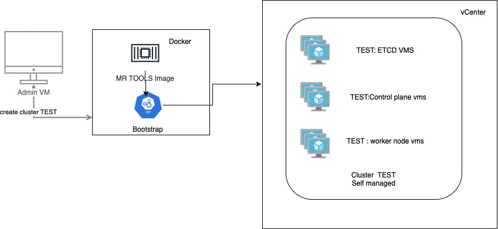
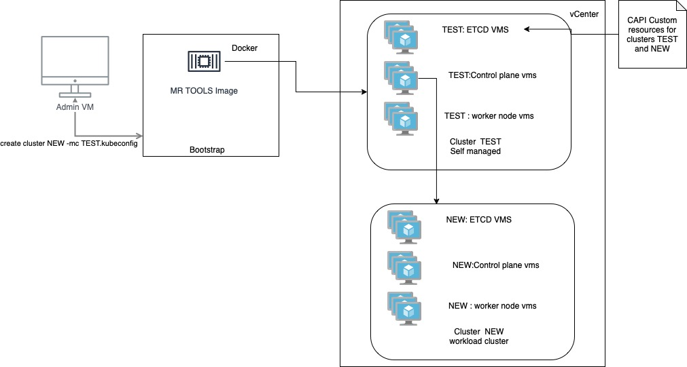
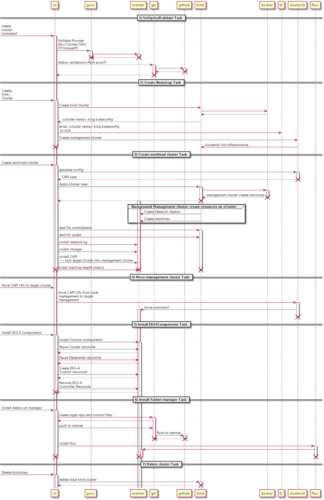
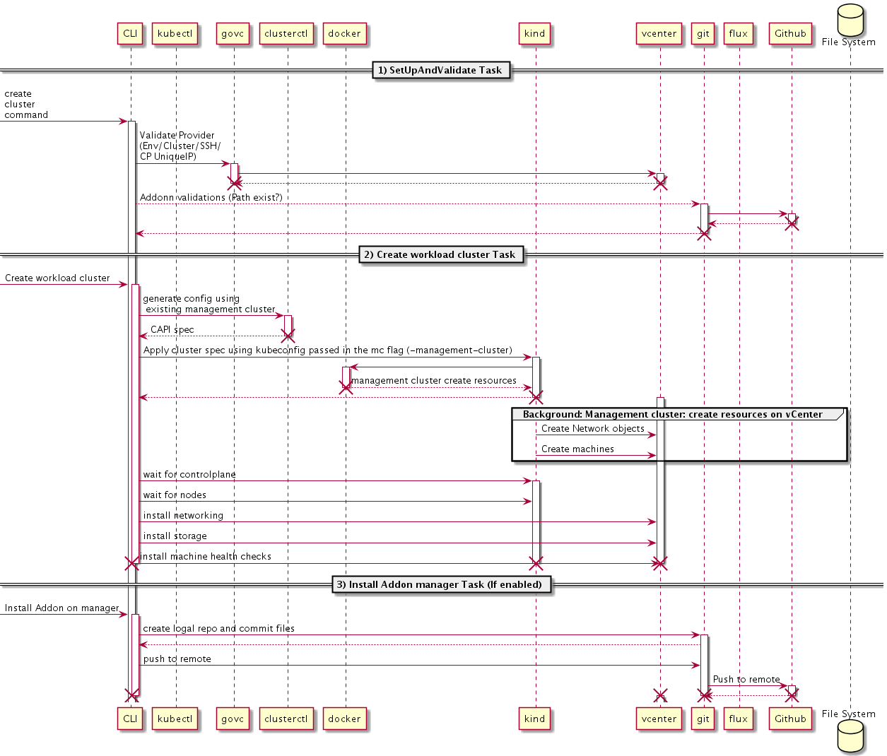

# EKS-A Support for workload clusters

# Separate management and workload clusters

## EKS Anywhere separate management cluster

Separate management clusters will provide better isolation of admin credentials, while giving non-admin users the ability to create workload clusters.

There are the main advantages of using a separate management cluster

1. Centralized admin credentials 
2. Shorter cluster creation times
3. Centralized auditing for cluster creation 
4. Better resource utilization
5. Centralized GitOps management

## Introduction

EKS Anywhere management clusters will improve user experience, security, and resource utilization when creating workload clusters.
Users will be able to create a management cluster using their admin credentials and allow non-admin users to create workload clusters using credentials with less privileges.
This is not a replacement for previous clusters, but rather another option to deploy separate management and workload clusters.

### Tenets

1. **Simple:** make the creation of workload clusters even simpler, faster, and more secure, avoiding the creation of a local Kind clusters with admin credentials when creating workload clusters.
1. **Declarative:** allow users to create management and workload clusters using existing specs.
1. **Opinionated Modularity:** provide opinionated defaults when creating clusters. The current created command creates management clusters, and users can use these management clusters to create workload clusters.
1. **Open:** the source for EKS Anywhere is already available at https://github.com/aws/eks-anywhere, which is validated and supported by Amazon.
1. **Better with AWS:** users can list both management and workload clusters in the EKS console.

### Goals and objectives

The main goal of allowing users to create workload clusters from a management cluster is to provide options for users that would prefer not to share admin credentials when creating clusters. 

Other goals include preparing EKS Anywhere for a full GitOps workflow and improving user experience, since cluster creation will be faster and more robust.

**As an admin I would like to create EKS clusters capable of creating workload clusters by**

* Using the same command used previously to create a cluster
* Allowing other users to create workload clusters without sharing admin credentials
* Keeping Vsphere credentials on a centralized server
* Being able to create clusters in an automated fashion without inserting admin credentials in the process

**As a developer/DevOps I would like to create workload clusters that** 

* Use a similar command used to create a workload cluster
* Create clusters faster

### Statement of scope

The goal of these changes is to introduce the concepts of a separate management cluster capable of creating workload clusters with the least amount of changes in code and user experience, while at the same time preparing components to move into controllers (cluster creation and full upgrade in EKS Anywhere controller, Add-on controller, etc.).

**In Scope**

* Add a new spec property to the EKS-A Cluster spec to identify management and workload clusters.
* Keep the existing create cluster command and use it to create management clusters.
* Add a new option to the create command that will accept a kubeconfig file pointing to a management cluster and that will create a new workload cluster.
* Modify ETCD and EKS-A controllers to support management and workload clusters
* Modify current workflows to use an existing management cluster 

**Out of Scope** 

* Move add-on functionality to controllers

**Future Scope**

* Cluster creation using GitOps 
* Allow users to create EKS-A clusters using GitOpts
* Dashboard/monitoring for the management cluster
* Management clusters upgraded by Flux (remove the need to run an upgrade command if the users chooses GitOps)
* Use the management cluster to verify that there are enough resources to create a workload cluster before starting the process
* New command to turn workload clusters into management clusters

## Overview of solution

The CREATE, DELETE*,* and UPGRADE commands are expressed by [workflow](https://github.com/aws/eks-anywhere/tree/v0.5.0/pkg/workflows) objects that use a [task runner](https://github.com/aws/eks-anywhere/blob/v0.5.0/pkg/task/task.go#L138) to execute a sequence of phases ([create](https://github.com/aws/eks-anywhere/blob/main/pkg/workflows/create.go#L63,L79), [upgrade](https://github.com/aws/eks-anywhere/blob/main/pkg/workflows/upgrade.go#L64-L92), and [delete](https://github.com/aws/eks-anywhere/blob/main/pkg/workflows/delete.go#L56-L70)).

Currently these steps are hard coded, and the workflows will try to follow the same steps for each execution of the  commands.

These are the steps for the create command workflow: 

1. [SetupAndValidate](https://github.com/aws/eks-anywhere/blob/v0.5.0/pkg/workflows/create.go#L67)
2. [CreateBoostrapCluster](https://github.com/aws/eks-anywhere/blob/v0.5.0/pkg/workflows/create.go#L63)
3. [CreateWorkloadCluster](https://github.com/aws/eks-anywhere/blob/v0.5.0/pkg/workflows/create.go#L69)
4. [MoveManagementCluster](https://github.com/aws/eks-anywhere/blob/v0.5.0/pkg/workflows/create.go#L75)
5. [Install EKSAComponents](https://github.com/aws/eks-anywhere/blob/v0.5.0/pkg/workflows/create.go#L71)
6. [InstallAddOns](https://github.com/aws/eks-anywhere/blob/v0.5.0/pkg/workflows/create.go#L73)
7. [DeleteBootstrap](https://github.com/aws/eks-anywhere/blob/v0.5.0/pkg/workflows/create.go#L79)

And these are the steps for the upgrade command:

1. [SetupAndValidate](https://github.com/aws/eks-anywhere/blob/v0.5.0/pkg/workflows/upgrade.go#L64)
2. [UpdateSecrets](https://github.com/aws/eks-anywhere/blob/v0.5.0/pkg/workflows/upgrade.go#L66)
3. [UpgradeNeeded](https://github.com/aws/eks-anywhere/blob/v0.5.0/pkg/workflows/upgrade.go#L68)
4. [PauseEksAAndFluxReconcile](https://github.com/aws/eks-anywhere/blob/v0.5.0/pkg/workflows/upgrade.go#L70)
5. [CreateBootstrapCluster](https://github.com/aws/eks-anywhere/blob/v0.5.0/pkg/workflows/upgrade.go#L72)
6. [InstallCAPI](https://github.com/aws/eks-anywhere/blob/v0.5.0/pkg/workflows/upgrade.go#L74)
7. [MoveManagementToBootstrap](https://github.com/aws/eks-anywhere/blob/v0.5.0/pkg/workflows/upgrade.go#L76)
8. [UpgradeWorkloadCluster](https://github.com/aws/eks-anywhere/blob/v0.5.0/pkg/workflows/upgrade.go#L84)
9. [MoveManagementToWorkload](https://github.com/aws/eks-anywhere/blob/529ff8a4defbae8d735ad1d166f372c348260a0d/pkg/workflows/upgrade.go#L82)
10. [UpdateCLusterAndGitResources](https://github.com/aws/eks-anywhere/blob/v0.5.0/pkg/workflows/upgrade.go#L88)
11. [Resume Flux Reconcile](https://github.com/aws/eks-anywhere/blob/v0.5.0/pkg/workflows/upgrade.go#L90)
12. [DeleteBootstrap](https://github.com/aws/eks-anywhere/blob/v0.5.0/pkg/workflows/upgrade.go#L86)


In addition to the commands above it is also possible to upgrade clusters using the [EKS Anywhere controller](https://github.com/aws/eks-anywhere/blob/v0.5.0/controllers/controllers/cluster_controller.go), which manages EKS-A specs and is responsible for upgrading machine deployments.
Some upgrades are currently not supported using GitOps, and it is the job of the [cluster webhook](https://github.com/aws/eks-anywhere/blob/v0.5.0/pkg/api/v1alpha1/cluster_webhook.go) to [validate](https://github.com/aws/eks-anywhere/blob/v0.5.0/pkg/api/v1alpha1/cluster_webhook.go#L71) these conditions. 
 
In order to introduce the creation/upgrade and deletion of separate management and workload clusters it will be necessary to modify the CLI, EKS-A controller/Webhook and ETCD controller.

### New Flag

When creating/upgrading/deleting clusters, users will be able to pass a new optional flag pointing to the kubeconfig file of a management cluster. 

```
createClusterCmd.Flags().BoolVar(&cc.managementCluster, "k", "kubeconfig", "", "kubeconfig to access an EKS Anywhere management cluster")
```

To create a workload clusters users will call the following command:

```
eksctl anywhere create cluster -f cluster-spec.yaml --kubeconfig managemet-cluster.kubconfig
```

When the flag is present the CLI will use the existing management cluster and will not execute the following phases of the workflow:

* CreateBootstrapCluster
* MoveManagementCluster
* InstallAddOn
* DeleteBootstrap


The new steps for the CREATE command will be:

1. [SetupAndValidate](https://github.com/aws/eks-anywhere/blob/v0.5.0/pkg/workflows/create.go#L67)
2. [CreateWorkloadCluster](https://github.com/aws/eks-anywhere/blob/v0.5.0/pkg/workflows/create.go#L69)
3. [InstallAddOns](https://github.com/aws/eks-anywhere/blob/v0.5.0/pkg/workflows/create.go#L73) — push code to Github

To upgrade a workload cluster users will run the following command:

```
eksctl anywhere upgrade cluster -f new-cluster-spec.yaml -mc managemet-cluster.kubconfig
```

The following phases will be executed for the UPGRADE command:

1. [SetupAndValidate](https://github.com/aws/eks-anywhere/blob/v0.5.0/pkg/workflows/upgrade.go#L64)
2. [PauseEksAAndFluxReconcile](https://github.com/aws/eks-anywhere/blob/v0.5.0/pkg/workflows/upgrade.go#L70)
3. [UpgradeWorkloadCluster](https://github.com/aws/eks-anywhere/blob/v0.5.0/pkg/workflows/upgrade.go#L84)
4. [UpdateCLusterAndGitResources](https://github.com/aws/eks-anywhere/blob/v0.5.0/pkg/workflows/upgrade.go#L88)
5. [Resume Flux Reconcile](https://github.com/aws/eks-anywhere/blob/v0.5.0/pkg/workflows/upgrade.go#L90)

### New field added to ClusterSpec

When creating clusters a new spec property will be added to the spec to differentiate between management and workload clusters.

```
type ClusterSpec struct {
    KubernetesVersion             KubernetesVersion              `json:"kubernetesVersion,omitempty"`
   ...
    Management                    *bool                          `json:"management,omitempty"`
}
```


Based on the value of “management” the CLI/controllers will choose the appropriate actions.

### Changes to Cluster Webhook

The validateImmutableFieldsCluster method will be modified to look for the label/annotation above on the cluster spec.
When the annotation is not present or the value is true the code will execute the same validations, and when the value is “false” the method will not run the validations.

### Changes to ETCD controller   

TODO

### Git Repository Layout for workload clusters

Currently when GitOps is enabled, files are created under the path “clusters/<cluster-name>”.
When creating workload clusters, files will be added under a folder that is used by a management cluster.
For example, if a user creates a management cluster with the name “test-m” then the following folder will be created on Github 

```
/clusters/test-m/...
```

If the user creates a workload cluster names test-w using test-m as the management cluster , then the following folder will be added to the repo:

```
/clusters/test-m/workload-clusters/test-w/...
```

Changes to files under /clusters/test-m/ and /clusters/test-m/workload-clusters/test-w/ will trigger a Flux update, which in turn will trigger the EKS Anywhere controller.

### Architectural or component-level design

 Currently the CLI creates clusters that are capable of running user workload and also have the CAPI management components. For this reason, users are not allowed to upgrade control plane components using Flux.


When creating workload clusters, users will pass the kubeconfig of an existing management cluster as part of the create command. This will signal to the CLI that the user wants to create a workload cluster.
The CLI will then skip the steps that are not necessary when creating workload clusters.


### Design details

The following picture shows the sequence of steps involved in creating a new EKS Anywhere cluster

When creating a workload cluster, the management cluster is provided as a parameter, and some steps can be skipped.
The following image shows the steps necessary to create a workload cluster when using an existing management cluster.


The process of skipping steps will be similar for the UPGRADE and DELETE commands.

## Major considerations

### User Experience

Users will be able to choose if they want to use management clusters as workload clusters, or if they will keep a management cluster responsible for creating workload clusters.

New documentation will be added explaining the differences and the reasons for creating management clusters. 

Backward compatibility will be accomplished through a separate task ([EKS-A Components upgrade](https://github.com/aws/eks-anywhere/blob/main/designs/component-upgrades.md). 

### Security

The main benefit of giving users the choice to use separate management clusters is to better isolate the admin credentials necessary to create clusters. 

### Scaling

Scaling workload clusters is similar to scaling management clusters. Users can upgrade the number of worker nodes of a management cluster in the cluster spec and run the upgrade command to scale horizontally, or they can use Flux (if enabled).

## Failure modes

Being a long running component, a management cluster may need to be highly available, and possibly have a separate dashboard to show its health and the health of each workload cluster it manages. This, however, is not the scope of these changes.

## Testing

### Test Scenario 1 - Create management cluster 

TODO - add description

### Test Scenario 2 - Create workload cluster using an existing cluster 

### Test Scenario 3 - Create workload cluster using an existing cluster with GitOps enabled

### Test Scenario 4 - Upgrade a cluster created with v0.5.0 using the v0.6.0 CLI

### Test Scenario 5 - Upgrade a cluster created with v0.6.0 using the v0.5.0 CLI

### Test Scenario 6 - Create a workload cluster with v0.6.0 using a management cluster created by 0v.5.0

## Observability - monitoring and metrics, logging, tracing

TODO

_**Metrics:**_
TODO 

_**Logging:**_
TODO

_**Tracing:**_
TODO

## Deployment

Deployment of these features can be done partially without affecting release cycles. The following steps can be implemented:

1. Add the new spec property (management *bool) to cluster specs during cluster creation 
2. Modify all methods that work on CAPI objects (e.g. waitFor.. methods) to be cluster aware
3. Modify EKS-A controller and Webhook to use the new spec property allowing it to run full upgrades of workload clusters 
4. Modify ETCD controller to be cluster aware (secret creation)
5. Modify create, upgrade, and delete flows to skip steps and reuse and existing management cluster when working on workload clusters


Ideally we should have some projects running on EKS Anywhere so we can better test these CLI upgrade scenarios. 

## FAQ

### Will users be able to create workload clusters on multiple namespaces?

 No.

### Will users be able to upgrade their existing clusters with new versions of the CLI?

No.

### Why don’t we introduce new custom resources (WorkLoadCluster and ManagementCluster)?

The goal is to allow users to create management clusters with minimal changes to their flows. Introducing new CaRs would force them to write new cluster specs, or we would have to write a tool to do the conversion for them. 

### Why don’t we move the logic into the EKS-A controller and provide a full GitOps based approach?

This will be done in future releases 

### What happens if users try to create/delete/upgrade a new cluster using an old binary?

An ERROR message should appear.

### What happens if someone tries to create a cluster using an underlying object that already exists?

TO-DO

### What happens with workload clusters during the upgrade of a management cluster?

Nothing. Workload clusters will still be available, but the reconciling process will be paused during the upgrade command. 

### What happens if the management cluster becomes unavailable? 

This should not affect the workload clusters, but users won’t be able to create new clusters or upgrade existing ones.

### Will management cluster be relevant for bare metal users?

Yes
